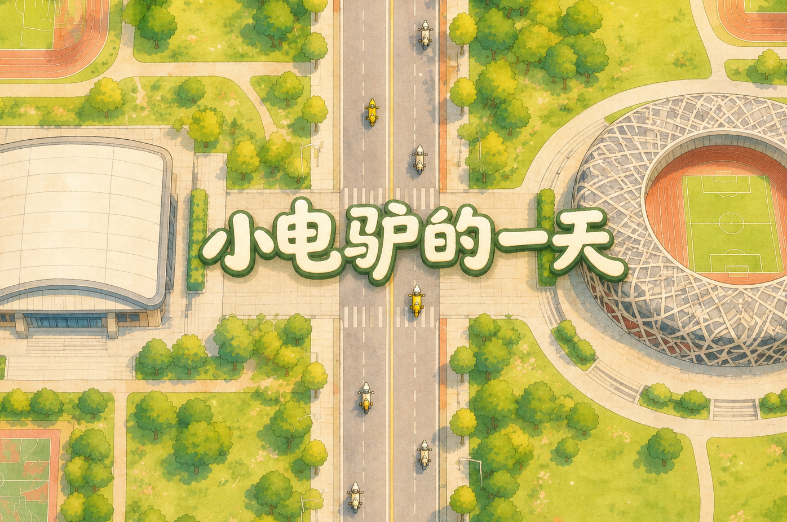

# 小电驴的一天



> 一款把大学生"骑小电驴上课"的日常难题做成闯关的网页小游戏：找车、赶课、停车、充电，五天不迟到就算赢。

**主题：Reimagine Campus** · 黑客松作品 · Phaser 3 网页游戏，浏览器打开即玩，一局 5–10 分钟。

---

## 要解决的问题

在校园里骑电动车的同学，每天都会遇到这些小麻烦：

- **早上找车难**：宿舍楼下车挤成一片，找不到自己的车，挪车还可能带倒一排。
- **路上不安全**：人车混行，有外卖车、逆行车、横穿的行人；校外还可能碰上交警查头盔和牌照。
- **停车没位置**：教学楼车棚车位紧张，门口违停会被贴条。
- **晚上充电难**：充电桩被占、坏了、扫码失败，门禁前没充上电，第二天就只能推车迟到。

这些问题很普遍，但平时很少有人认真聊，也很难让没骑过车的人体会到。

## 我们的方案

把这些真实场景做成一天里的几个关卡，让玩家在游戏里亲身经历一遍：

```
宿舍楼下找车 → 校门口选路线 → 骑车上学 → 车棚停车 → 上午课
   → 中午（吃饭 / 办牌照）→ 下午课 → 傍晚 → 晚上找桩充电 → 今日评价 → 第二天
```

电量、钱、饥饿度和迟到次数会跨天累积，玩家要在**省时间、省钱、守规矩**之间做取舍，由此引出对车位、充电桩和交通秩序的思考。

## 快速开始

游戏用到了图片和音效，需要通过本地服务器打开（直接双击 `index.html` 会加载失败）。任选一种方式：

**方式一：VS Code**
1. 安装 **Live Server** 插件
2. 用 VS Code 打开本文件夹，右键 `index.html` → **Open with Live Server**

**方式二：命令行**
```bash
# 在项目根目录下
python -m http.server 8000
# 然后浏览器打开 http://localhost:8000
```


> 更新了素材但看不到变化？按 **Ctrl + F5** 强制刷新。

## 操作

| 按键 | 作用 |
|---|---|
| W A S D / 方向键 | 移动；骑车时 W 前进、S 刹车、A / D 换道 |
| F | 交互 / 确认（挪车、停车、扫码、扶车……） |
| E | 打开背包（戴 / 摘头盔、查看钱和饥饿度；骑车时不能开） |
| 弹窗里 | A / D（或 W / S）切换选项，F 确认，也可以用鼠标点 |

## 玩法

### 关卡

| 关卡 | 你要做什么 | 会遇到的麻烦 |
|---|---|---|
| **找车** | 在宿舍楼下的车阵里，靠钥匙信号的滴滴声找到自己的车 | 车被堵在里面要挪开邻车，可能带倒一排，得全部扶起来 |
| **骑行** | 8:00 前骑到教学楼 | 外卖车、逆行车、行人、校车、汽车；被撞多了会摔倒；校内有大坡，早高峰可能有单行道；没电只能推车，直接迟到 |
| **交警检查** | 停车接受检查，或者硬闯 | 没戴头盔、没上牌、载人都要罚款；硬闯可能被带去派出所 |
| **停车** | 在车棚里找到空车位 | 撞到别人的车会倒一排；门口违停省时间，但可能被贴条 |
| **中午 / 傍晚** | 选择去食堂、后湖或者办牌照 | 花钱、花时间，拖太久下午就迟到 |
| **充电** | 23:00 门禁前找到能用的充电桩 | 被占、坏了、扫码失败；插上后能不能充满，第二天早上才知道 |

### 资源

- **电量**：骑车耗电，爬坡、载人耗得更快；没电只能推车。
- **钱**：生活费每天到账，罚款、吃饭、充电、办牌照都要花钱。
- **饥饿度**：上课会饿，饿了走得慢。
- **迟到次数**：决定最终结局。

### 6 个结局

| 结局 | 条件 |
|---|---|
| 完美 | 5 天迟到 0 次 |
| 合格 | 迟到 1–5 次 |
| 不合格 | 迟到 6 次及以上 |
| 隐藏 · 派出所 | 碰到交警硬闯，被抓 |
| 隐藏 · 昏倒 | 饥饿度降到 0 |
| 隐藏 · 身无分文 | 钱花光了 |

## 技术实现

- **引擎**：[Phaser 3.90](https://phaser.io/)（CDN 引入），原生 JavaScript，不需要构建工具
- **画面**：960 × 540，Arcade 物理
- **数据驱动**：数值集中在 `src/config.js`，文案集中在 `src/lines.js`，素材清单在 `src/assets.js`。缺图时自动用色块占位，美术和程序可以并行开发
- **AI Coding 工具**：Claude Code

### 目录结构

```
FedExing/
├── index.html              入口
├── src/
│   ├── config.js           数值表（速度、耗电、概率、罚款……）
│   ├── lines.js            全部文案
│   ├── assets.js           素材清单
│   ├── state.js            游戏状态、跨天结算、结局判定
│   ├── ui.js               公用界面：时钟、HUD、气泡、弹窗、音效
│   ├── main.js             创建游戏、场景注册、调试开关
│   └── scenes/             各个场景
│       ├── Boot.js  Title.js  Intro.js
│       ├── FindCar.js      找车
│       ├── NodeScene.js    校门口 / 中午 / 傍晚选择
│       ├── Ride.js         骑行
│       ├── Park.js         停车
│       ├── Class.js        上课过场
│       ├── Charge.js       充电
│       ├── Result.js       今日评价
│       └── Ending.js       结局
├── assets/
│   ├── img/                背景、角色、车辆、道路、结局插画、界面
│   └── sfx/                音效
└── doc/                    开发文档（架构设计、事件流程、美术工作文档等）
```

### 调试

在 `src/main.js` 里把 `DEBUG_START` 改成场景名（如 `'Ride'`、`'Park'`、`'Charge'`、`'Ending'`），刷新后直接从该场景开始；`DEBUG_STATE` 可以覆盖初始状态，例如 `{ day: 5, lateCount: 3 }` 直接跳到第 5 天。详细说明见 [`doc/CLAUDE.md`](doc/CLAUDE.md)。**演示前记得改回 `null`。**

## 团队

| 成员 | 分工 |
|---|---|
| 周德诺 | 主程序与整体架构：游戏框架和状态系统、全部场景玩法、美术素材接入与版本整合 |
| 林哲涵 | 工程基础与资源：项目结构搭建、素材整理与补充、文本框 / 交警 / 道路素材 |
| 郭鸿毅 | 美术：场景背景、结局插画、车辆素材 |
| 古天豪 | 音效：游戏音效制作与接入 |

## 文档

- [`doc/项目说明.md`](doc/项目说明.md)：玩法概览与分工
- [`doc/事件流程.md`](doc/事件流程.md)：所有事件的触发条件、数值和概率
- [`doc/架构设计.md`](doc/架构设计.md)：代码架构
- [`doc/美术与动效工作文档.md`](doc/美术与动效工作文档.md)：美术规范
- [`doc/CLAUDE.md`](doc/CLAUDE.md)：开发约定（给 AI 和开发者看）
