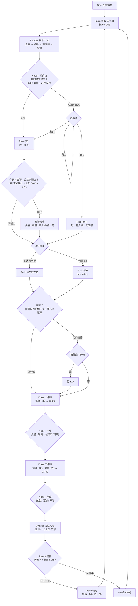

# 《小电驴的一天》事件流程

> 依据：`CLAUDE.md` + 当前 `src/` 代码（2026-09-26）。两者冲突以 CLAUDE.md 为准，发现不一致请在群里说。
> 数值写的是 `CONFIG` 里的 key 和当前值，D 调数值后这里的数字可能过时，以 config.js 为准。

---

## 1. 一天的总流程

---

## 2. 时间线（游戏内）

| 时刻 | 发生什么 | 谁控制 |
|---|---|---|
| 7:35 | 出门找车（`startClock`） | FindCar 开场强制设置 |
| 7:35 → ? | 找车、骑车、停车，时钟一直走（现实 1 秒 = 游戏 10 秒） | `UI.tickClock` |
| 8:00 | 上课。停好车晚于此刻 → 迟到（`classStart`） | Park |
| 12:00 | 上午课结束（`noonClock`） | Class 直接跳 |
| 17:30 | 下午课结束（`eveningClock`） | Class 直接跳 |
| 22:40 | 开始找充电桩（`nightClock`） | Charge 开场强制设置 |
| 23:00 | 宿舍门禁（`curfew`），没插上 → 今晚充不上 | Charge |

弹窗打开时时钟暂停；Node、Class、Intro、Result 不走钟。

---

## 3. 事件明细

### 3.1 早上 · FindCar 找车

| 事件 | 触发 | 结果 / 状态变化 |
|---|---|---|
| 开场独白 | 进场 | 饿了说 `LINES.hungry`，否则 `findCar.start` |
| 钥匙信号 | 每帧 | 越近"滴"越快，右上角信号格 1–5 |
| 查看别人的车 | 靠近 + F | `findCar.notMine` 随机一句 |
| 认出自己的车 | 第一次对自己的车按 F | 变黄 + `findCar.blocked`（被夹住） |
| 挪开邻车 | 认出后，对左右邻车按 F | clock + `moveCarMinutes`(1) |
| 解锁 | 挪过至少 1 辆后，对自己的车按 F | 写 `findCarMinutes` → Node{gate} |
| 开背包 | E | 可戴 / 摘头盔（**不会提醒要戴**） |

无失败条件，只会耗时间。

### 3.2 早上 · Node{gate} 校门口

| 事件 | 触发 | 选项 → 结果 |
|---|---|---|
| 同学求搭车 | 第 1 天必出；之后 `passenger.chance`(50%) | 答应 → `passenger=true`，**强制走校外**，不再给路线选择 拒绝 → 进入选路线 |
| 选路线 | 没人搭车 / 拒绝后 | 校内 → `route='inside'`；校外 → `route='outside'`；背包 → 看完回来重选 |

### 3.3 早上 · Ride 骑行

| 事件 | 触发 | 结果 / 状态变化 |
|---|---|---|
| 障碍生成 | 每 `spawnEvery` 毫秒左右（±40%） | 按路线权重选类型（见下表） |
| 被撞 | 碰到障碍、不在无敌时间 | hp −1，hits +1，震屏，后退，1 秒无敌 |
| 摔倒 | hp = 0 | 连按 F `pickupPresses`(5) 次扶车 → hp 回满，电量 −`fallBatteryCost`(10)，falls +1 |
| 上坡 | 只有校内，路程 45%–65% | 速度 ×0.7，耗电 0.45 → 1.0 %/秒 |
| 电量告急 | 电量 < 15 | 独白 `ride.lowBattery`（只说一次） |
| 交警预告 | 离检查点 < 700px | 独白 `ride.policeAhead` |
| **交警检查** | 校外 + `policeToday`，路程 55% 处 | 见 3.4 |
| 没电 | 电量 ≤ 0（含扶车掉电后） | late=true，clock +`deadBatteryMinutes`(15)，载人则同学走人不给钱 → Park{pushing:true} |
| 到达 | 骑到教学楼 | 载人 → +`passenger.reward`(¥15)，earned +15 → Park{pushing:false} |
| 按 E | 骑行中 | 不开背包，只说 `backpack.noRide` |

障碍权重：

| 类型 | 行为 | 校内 | 校外 |
|---|---|---|---|
| 外卖车 delivery | 从后面冲上来，屏幕底部闪"！" | 2 | 3.5 |
| 逆行车 wrong | 迎面来，50% 就在你这条道 | 2.5 | 2.5 |
| 行人 walker | 从路边横穿 | 3.5 | 1 |
| 校车 bus | 又大又慢，挡路 | 2 | 0 |
| 汽车 car | 同向慢开，挡路 | 0 | 3 |

### 3.4 交警检查（Ride 校外 / Node 后湖 共用 `policeCheck`）

| 检查项 | 条件 | 罚款 |
|---|---|---|
| 没戴头盔 | `helmetOn = false` | ¥20 |
| 没牌照 | `items.license = false` | ¥30 |
| 载人 | 正在载同学（只有 Ride 会是 true） | ¥30 |

- 有任何一笔罚款：耽误 `delayMinutes`(10) 分钟；全部合格：停 `passMinutes`(1) 分钟。
- 钱可以扣成负数（欠款）。罚款记进 `fines`，**不算进 `spent`**。
- 载人被罚 → 同学跑掉，拿不到报酬。
- **碰不碰得上**：`policeToday` 每天掷一次（第 1 天必有，之后 `police.chance` 50%）。有交警的日子，校外骑行、中午后湖、傍晚后湖**各自再掷一次** `police.encounterChance`(60%)。例外：第 1 天校外骑行必碰上（新手教学）。
- 载人本身就是罚款项，所以**碰到交警，载人必被罚、同学必跑**（设计如此）。想赚这 ¥15，就得赌今天没交警。

### 3.5 停车 · Park

| 事件 | 触发 | 结果 |
|---|---|---|
| 进场 | 骑车 / 推车 | 推车：速度 ×0.5，左上角"已迟到"，独白 `park.pushing` |
| 看别人的车 | 靠近 + F | `park.full` 随机一句 |
| 停车 | 站到空位（`freeSlots`=2 个，不在入口 6 格内）+ F | 写 `arriveClock`；晚于 8:00 → late=true → Class{morning} |
| **多米诺** | 骑 / 推着车撞到别人的车（有速度才算；判定一次后 `dominoCooldownMs` 1.5 秒内不再判定），按 `dominoChance`(50%) 触发 | 从被撞那辆开始，往远离玩家的方向一辆接一辆倒下，最多 `dominoMax`(6) 辆，遇到空位 / 排尾 / 已倒的车就停。震屏 + 独白 `park.domino` |
| 扶车 | 靠近倒着的车（< 50px）+ F | 一次扶一辆，clock +`liftMinutes`(0.5)；全扶完说 `park.liftedAll` |
| 没扶完就停车 | 还有倒着的车时在空位 / 禁停区按 F | 不停车，说 `park.liftFirst` |
| **门口违停** | 站进入口旁红色"禁停"区 + F | 二选一：「就停一会儿」/「算了」。停：照常写 `arriveClock`、判迟到；再按 `ticketChance`(50%) 被保安贴条，罚 `ticketFine`(¥20)，记进 `fines`、不算 `spent`，弹窗后进 Class。没被贴条 → 说 `park.noTicket` |

### 3.6 白天 · Class 上课过场（自动，F 可跳过）

| 段 | 状态变化 | 下一步 |
|---|---|---|
| 上午课 | 饥饿 −`perClass`(35)；clock = 12:00；显示是否迟到 | Node{noon} |
| 下午课 | 饥饿 −35；电量 −`dayDrain`(20)；clock = 17:30 | Node{evening} |

### 3.7 中午 / 傍晚 · Node{noon / evening}

| 选项 | 花费 | 效果 | 置灰条件 |
|---|---|---|---|
| 食堂 | ¥12 | 饱腹 +45 | 钱不够 |
| 后湖 | ¥25 + 电 10% | 饱腹 +70；今天有交警时按 `encounterChance`(60%) 碰上检查（查头盔、牌照） | 钱不够 / 电 < 10 |
| 办牌照（仅中午、没牌照时） | ¥30 | `items.license=true`，吃不上饭 | 钱不够 |
| 不吃 | 0 | — | — |
| 背包 | — | 看完回到菜单 | — |

- 后湖被罚后钱不够 ¥25 → 饿着回去（`meals.fineNoFood`），电照样扣了。
- 今天有交警时，中午、傍晚去后湖**各自单独掷**是否碰上，所以一天最多被查两次（设计如此）。

### 3.8 晚上 · Charge 充电

桩的分配（每晚随机打乱）：1 个空闲、2 个扫码失败、2 个坏的、其余 3 个被占。

| 桩 | 按 F 的结果 |
|---|---|
| 被占 occupied | 吐槽，桩变灰 |
| 坏了 broken | 吐槽，桩变深灰 |
| 扫码失败 qrFail | 第一次必失败（clock +0.5 分钟）；之后每次 `qrRetryChance`(50%) 成功 |
| 空闲 free | 直接插上 |
| 能插的桩但钱 < ¥2 | `charge.noMoney`，记下"没钱" |

插上后（扣 ¥2）二选一：

| 选择 | 结果 | chargeResult |
|---|---|---|
| 守着它 | 电量 + `watchPerMinute`(5) × 剩余分钟，clock = 23:00 | `watch` |
| 先回宿舍 · 赌赢（`gambleWinRate` 50%） | 电量 = 100 | `full` |
| 先回宿舍 · 赌输 | 电量 + `unpluggedGain`(20) | `unplugged` |
| 23:00 前没插上 | 不变 | `none`；遇到过"没钱" → `noMoney` |

### 3.9 Result 结算

结局 = 是否迟到 × 电量是否 ≥ `chargedThreshold`(60)：

| | 电量 ≥ 60 | 电量 < 60 |
|---|---|---|
| **准时** | 难得顺利的一天 | 明天早上见分晓 |
| **迟到** | 至少明天有电了 | 明天还得推车 |

F → `nextDay()`：保留电量、钱、饥饿、背包（头盔戴没戴也保留）；饥饿 −20，钱 +30，其余按 `resetDay()` 清空。
R → `newGame()`：全部重来。

---

## 4. 随机事件汇总

| 事件 | 第 1 天 | 第 2 天起 | 在哪决定 |
|---|---|---|---|
| 今天有交警 | 必有 | `police.chance` 50% | `resetDay()` |
| 校外骑行碰上交警 | 必碰上 | 有交警时 `encounterChance` 60%（合计 30%） | Ride |
| 后湖碰上交警（每次） | 有交警时 60% | 有交警时 60%（合计 30%） | Node |
| 同学求搭车 | 必有 | `passenger.chance` 50% | Node{gate} |
| 自己车的位置 | 随机（左右必有车夹着） | 同 | FindCar |
| 空车位位置 | 随机 2 个，不在入口附近 | 同 | Park |
| 撞车倒一排 | `dominoChance` 50% | 同 | Park |
| 违停被贴条 | `ticketChance` 50% | 同 | Park |
| 充电桩状态 | 随机打乱 | 同 | Charge |
| 扫码重试成功 | 50% | 同 | Charge |
| 回宿舍充满 | 50% | 同 | Charge |
| 障碍类型 / 车道 / 间隔 | 随机 | 同 | Ride |

---

## 5. 资源流向（D 调数值参考）

**电量**（唯一真正卡住玩家的资源）

| 去向 / 来源 | 数值 |
|---|---|
| 第 1 天早上 | 50 |
| 校内骑行（理想无碰撞） | 约 −39%（平路 ≈22 + 坡 ≈17），约 65 秒 ≈ 11 游戏分钟 |
| 校外骑行（理想无碰撞） | 约 −15%，约 33 秒 ≈ 5.5 游戏分钟 |
| 载人 | 耗电 ×1.3，速度 ×0.85（校外约 −22%） |
| 每摔一次 | −10 |
| 后湖一次 | −10 |
| 下午课结束 | −20 |
| 守着充 | +5/分钟，20 分钟最多 +100 |
| 回宿舍 | 50% 充满 / 50% 只 +20 |

> 估算：没加速过程、没被撞后退，只作量级参考。第 1 天 50% 电走校内，到教学楼约剩 11%，再扣 20 → 晚上 ≈ 0 起步。

**钱**：起始 ¥100，每天 +30；支出：食堂 12、后湖 25、牌照 30、充电 2、罚款：交警 20/30/30、违停贴条 20；收入：载人 +15。

**饥饿**：起始 70，每段课 −35，过夜 −20，< 30 算饿（所有移动 ×0.7）。不吃午饭 → 下午课后 0，傍晚那顿必须吃。

---

## 6. 已确认的设计（2026-09-26）

1. `项目说明.md` 的流程图、交接表、GameState 表已按现在的代码更新。
2. 载人 + 碰到交警 = 必罚、同学跑掉：保留，第 1 天答应搭车就是亏。
3. 后湖一天可能被查两次：保留，交警本身是随机出现的。
4. 答应搭车后直接出发、不能再开背包：保留，头盔要在找车时按 E 提前戴。
5. 交警改成"每次单独随机"：有交警的日子，每个可能碰上的地方各掷 `encounterChance`（已实现）。
6. 加分项"停车多米诺""门口违停"已实现（Park.js）；Result 的"交警罚款"一行改名为"罚款"，违停贴条也记在这里。
