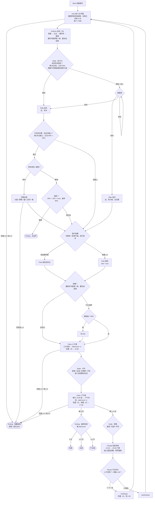

# 《小电驴的一天》事件流程

> 依据：`CLAUDE.md` + 当前 `src/` 代码（2026-09-26）。两者冲突以 CLAUDE.md 为准，发现不一致请在群里说。
> 数值写的是 `CONFIG` 里的 key 和当前值，D 调数值后这里的数字可能过时，以 config.js 为准。

---

## 1. 一天的总流程

一局 `ending.totalDays`(5) 天。第 1–4 天走完整一天；第 5 天下午课结束直接进最终结局。随时可能掉进隐藏结局（见 3.10）。

> 图里只画了主要的隐藏结局入口。Node 每个选项之后、Park 贴条后、Charge 扫码后也会查钱 / 饥饿，后湖碰到交警同样是"停车受检 / 硬闯"，完整检查点见 3.10。Ending 按 F → `newGame()` 回 Intro。

---

## 2. 时间线（游戏内）

| 时刻 | 发生什么 | 谁控制 |
|---|---|---|
| 7:35 | 出门找车（`startClock`） | FindCar 开场强制设置 |
| 7:35 → ? | 找车、骑车、停车，时钟一直走（现实 1 秒 = 游戏 15 秒，`timeScale`） | `UI.tickClock` |
| 8:00 | 上课。停好车晚于此刻 → 上午迟到（`classStart`） | Park |
| 12:00 | 上午课结束（`noonClock`） | Class 直接跳 |
| 12:00 → ? | 中午选项各花一段时间（`places.*.minutes`，不吃 = 0） | Node |
| 14:00 | 下午上课（`afternoonClass`）。中午选项花完晚于此刻 → 下午迟到 | Class 下午 |
| 17:30 | 下午课结束（`eveningClock`）；第 5 天到这里直接进最终结局 | Class 直接跳 |
| 22:40 | 开始找充电桩（`nightClock`） | Charge 开场强制设置 |
| 23:00 | 宿舍门禁（`curfew`），没插上 → 今晚充不上 | Charge |

弹窗打开时时钟暂停；Node、Class、Intro、Result、Ending 不走钟（Node 的选项直接加分钟；傍晚选项也加，但 Charge 开场会把时钟设到 22:40，所以不影响）。

演示时长：熟练的人一天约 2 分钟，5 天 5–10 分钟。

---

## 3. 事件明细

### 3.0 早上 · Intro 开场

| 事件 | 触发 | 结果 |
|---|---|---|
| 隐藏结局检查 | 第 2 天起进场（`nextDay()` 已扣完过夜饥饿） | `hiddenEndingKey()`：饥饿 ≤ 0 → 昏倒；钱 ≤ 0 → 身无分文 |
| 揭晓昨晚充电 | Result 传来 `{ lastCharge }` 为 `full` / `unplugged` | 开场文案前加 `charge.full`「满电！」/ `charge.unplugged`「线又被拔了」 |
| 本周迟到 | 每天 | 显示「本周已迟到 N 次」；最后一天加「今天是最后一天。」 |
| 饿晕预兆 | 饥饿 < `hunger.faintWarn`(15) | 红字 `LINES.faintWarn`「眼前发黑……」 |

### 3.1 早上 · FindCar 找车

| 事件 | 触发 | 结果 / 状态变化 |
|---|---|---|
| 开场独白 | 进场 | 饿了说 `LINES.hungry`，否则 `findCar.start` |
| 钥匙信号 | 每帧 | 越近"滴"越快，右上角信号格 1–5 |
| 查看别人的车 | 靠近 + F | `findCar.notMine` 随机一句 |
| 认出自己的车 | 第一次对自己的车按 F | 变黄 + `findCar.blocked`（被夹住） |
| 挪开邻车 | 认出后，对左右邻车按 F | clock + `moveCarMinutes`(1) |
| **多米诺** | 挪开邻车时按 `findCar.dominoChance`(40%) 触发（走路蹭到车**不**触发） | 往远离自己车的方向，同一排一辆接一辆倒下，最多 `dominoMax`(4) 辆，遇到挪开的 / 已倒的 / 排尾就停。震屏 + 独白 `park.domino` |
| 扶车 | 靠近倒着的车 + F | 一次扶一辆，clock +`findCar.liftMinutes`(0.5)；全扶完说 `park.liftedAll` |
| 解锁 | 挪过至少 1 辆、**倒着的车全扶起来**后，对自己的车按 F | 写 `findCarMinutes` → Node{gate}；没扶完说 `park.liftFirst` |
| 开背包 | E | 可戴 / 摘头盔（**不会提醒要戴**） |

车阵 `findCar.rows × cols` = 4 × 8。无失败条件，只会耗时间。

### 3.2 早上 · Node{gate} 校门口

| 事件 | 触发 | 选项 → 结果 |
|---|---|---|
| 单行道传闻 | 进场时两条路线各掷一次 `ride.oneWay.chance`(50%) | 堵的那条在问题后面加一句 `gate.rumorInside` / `rumorOutside`「听说……挤成单行道了」；结果通过 `{ oneWay }` 传给 Ride |
| 同学求搭车 | 第 1 天必出；之后 `passenger.chance`(50%) | 答应 → `passenger=true`，**强制走校外**，不再给路线选择 拒绝 → 进入选路线 |
| 选路线 | 没人搭车 / 拒绝后 | 校内 → `route='inside'`；校外 → `route='outside'`；背包 → 看完回来重选 |

### 3.3 早上 · Ride 骑行

| 事件 | 触发 | 结果 / 状态变化 |
|---|---|---|
| 障碍生成 | 每 `spawnEvery` 毫秒左右（±40%） | 按路线权重选类型（见下表）；出生点 `followGap`(90px) 内同道有车就换道，四条都有就这次不生成 |
| 车道让行 | 每帧 | 车和车不穿模：汽车 / 校车追上前车就减速排队；外卖车换到旁边空道超车；逆行车迎面有车就躲开，躲不开就停；行人前方有车驶近就在路边等 |
| 被撞 | 碰到障碍、不在无敌时间 | hp −1，hits +1，震屏，后退，1 秒无敌 |
| 摔倒 | hp = 0 | 连按 F `pickupPresses`(5) 次扶车 → hp 回满，电量 −`fallBatteryCost`(10)，falls +1 |
| 上坡 | 只有校内，路程 45%–65% | 速度 ×0.7，耗电 0.8 → 1.8 %/秒 |
| **单行道路段** | 校门口掷到堵，路程 `oneWay.range` 30%–70% | 路面淡红、路边牌子「早高峰 被挤成单行道」，进入时独白 `ride.oneWayEnter`；逆行权重 ×`wrongMul`(3)，逆行车在你这条道的概率 0.5 → `sameLaneChance`(0.8) |
| 电量告急 | 电量 < 15 | 独白 `ride.lowBattery`（只说一次） |
| 交警预告 | 离检查点 < 700px | 独白 `ride.policeAhead` |
| **交警检查点** | 校外 + `policeToday` + 这次碰上，路程 55% 处 | 先二选一：停车受检 / 硬闯，见 3.4 |
| 没电 | 电量 ≤ 0（含扶车掉电后） | late=true，clock +`deadBatteryMinutes`(15)，载人则同学走人不给钱 → Park{pushing:true} |
| 到达 | 骑到教学楼 | 载人 → +`passenger.reward`(¥15)，earned +15 → Park{pushing:false} |
| 按 E | 骑行中 | 不开背包，只说 `backpack.noRide` |

障碍权重：

| 类型 | 行为 | 校内 | 校外 |
|---|---|---|---|
| 外卖车 delivery | 从后面冲上来，屏幕底部闪"！" | 2 | 3.5 |
| 逆行车 wrong | 迎面来，50% 就在你这条道（单行道路段 80%，权重 ×3） | 2.5 | 2.5 |
| 行人 walker | 从路边横穿 | 3.5 | 1 |
| 校车 bus | 又大又慢，挡路 | 2 | 0 |
| 汽车 car | 同向慢开，挡路 | 0 | 3 |

### 3.4 交警（Ride 校外 / Node 后湖）：停车受检 or 硬闯

碰到交警先弹二选一 `police.askStop`：「停车接受检查」/「硬闯过去」。第 1 天新手教学也给这个选择。

**停车受检**（Ride / 后湖共用 `policeCheck`）：

| 检查项 | 条件 | 罚款 |
|---|---|---|
| 没戴头盔 | `helmetOn = false` | ¥20 |
| 没牌照 | `items.license = false` | ¥30 |
| 载人 | 正在载同学（只有 Ride 会是 true） | ¥30 |

- 有任何一笔罚款：耽误 `delayMinutes`(10) 分钟；全部合格：停 `passMinutes`(1) 分钟。
- 钱可以扣成负数（欠款）。罚款记进 `fines`，**不算进 `spent`**。弹窗关掉后查 `hiddenEndingKey()`，罚到钱 ≤ 0 → 身无分文结局。
- 载人被罚 → 同学跑掉，拿不到报酬。载人本身就是罚款项，所以**停车受检时载人必被罚、同学必跑**。

**硬闯**（`tryRun()`）：

| 结果 | 概率 | 效果 |
|---|---|---|
| 被抓 | `runCatchChance()` = `runCatchBase`(0.3) + `runs` × `runCatchStep`(0.15)，最多 `runCatchMax`(0.9)，即 30% → 45% → 60% … | 直接 `UI.fadeTo(this, 'Ending', { key: 'police' })` → **派出所**结局 |
| 闯过去 | 其余 | 不罚款、不耽误时间，`runs + 1`；载的同学不跑、到了照样给钱。Ride 里路障变淡、`runProtectMs`(2 秒) 无敌闪烁；独白 `police.runOk`，稍后预兆 `police.runOmen`「交警好像记住我的车了……」 |

- **越闯越容易被抓**：第一次闯大多能过，闯多了迟早进派出所。
- **碰不碰得上**：`policeToday` 每天掷一次（第 1 天必有，之后 `police.chance` 50%）。有交警的日子，校外骑行、中午后湖、傍晚后湖**各自再掷一次** `police.encounterChance`(60%)。例外：第 1 天校外骑行必碰上（新手教学）。

### 3.5 停车 · Park

| 事件 | 触发 | 结果 |
|---|---|---|
| 进场 | 骑车 / 推车 | 推车：速度 ×0.5，左上角"已迟到"，独白 `park.pushing` |
| 看别人的车 | 靠近 + F | `park.full` 随机一句 |
| 停车 | 站到空位（`freeSlots`=2 个，不在入口 6 格内）+ F | 写 `arriveClock`；晚于 8:00 → late=true → Class{morning} |
| **多米诺** | 骑 / 推着车撞到别人的车（有速度才算；判定一次后 `dominoCooldownMs` 1.5 秒内不再判定），按 `dominoChance`(50%) 触发 | 从被撞那辆开始，往远离玩家的方向一辆接一辆倒下，最多 `dominoMax`(6) 辆，遇到空位 / 排尾 / 已倒的车就停。震屏 + 独白 `park.domino` |
| 扶车 | 靠近倒着的车（< 50px）+ F | 一次扶一辆，clock +`liftMinutes`(0.5)；全扶完说 `park.liftedAll` |
| 没扶完就停车 | 还有倒着的车时在空位 / 禁停区按 F | 不停车，说 `park.liftFirst` |
| **门口违停** | 站进入口旁红色"禁停"区 + F | 二选一：「就停一会儿」/「算了」。停：照常写 `arriveClock`、判迟到；再按 `ticketChance`(50%) 被保安贴条，罚 `ticketFine`(¥20)，记进 `fines`、不算 `spent`，弹窗关掉后查 `hiddenEndingKey()`（罚到钱 ≤ 0 → 身无分文），否则进 Class。没被贴条 → 说 `park.noTicket` |

### 3.6 白天 · Class 上课过场（自动，F 可跳过）

| 段 | 状态变化 | 下一步 |
|---|---|---|
| 上午课 | `late` 为 true → `lateCount +1`；饥饿 −`perClass`(25)；clock = 12:00；显示到教室时间、是否迟到、本周累计迟到 | Node{noon} |
| 下午课 | 进场时 clock > `afternoonClass`(14:00) → `latePM = true`、`lateCount +1`，显示「到教室时间 14:10 —— 迟到了」；饥饿 −25；电量 −`dayDrain`(20)；clock = 17:30 | 第 1–4 天 → Node{evening}；第 5 天（`isLastDay()`）→ Ending{`finalEndingKey()`} |

- 离开时先查 `hiddenEndingKey()`：饥饿扣到 ≤ 0 → **昏倒**；钱 ≤ 0 → **身无分文**。优先于最终结局。
- 饥饿 < `faintWarn`(15) 且 > 0 时多一行预兆 `LINES.faintWarn`「眼前发黑……」。

### 3.7 中午 / 傍晚 · Node{noon / evening}

| 选项 | 花费 | 花的时间 `minutes` | 效果 | 置灰条件 |
|---|---|---|---|---|
| 食堂 | ¥12 | 40–60 分钟 | 饱腹 +45 | 钱不够 |
| 后湖 | ¥25 + 电 10% | 90–130 分钟 | 饱腹 +70；今天有交警时按 `encounterChance`(60%) 碰上交警，停车受检（查头盔、牌照）/ 硬闯，见 3.4 | 钱不够 / 电 < 10 |
| 办牌照（仅中午、没牌照时） | ¥30 | 100–140 分钟 | `items.license=true`，吃不上饭 | 钱不够 |
| 不吃 | 0 | 0 | — | — |
| 背包 | — | — | 看完回到菜单 | — |

- 选项上显示「约 N 分钟」（区间平均值），玩家自己权衡下午会不会迟到。中午：食堂、不吃不会迟到；后湖约 25%（被罚再 +10 分钟约 50%）；办牌照约 50%。
- 花完钱会 ≤ 0 的选项后面加 `meals.lastMoney`「（买完就身无分文了）」，**不置灰**，让玩家自己选。
- 每个选项 `finish()` 时查 `hiddenEndingKey()`，钱花到 ≤ 0 → 身无分文结局，否则中午 → Class{afternoon}，傍晚 → Charge。
- 后湖停车受检被罚后钱不够 ¥25 → 饿着回去（`meals.fineNoFood`），电照样扣了。后湖硬闯成功 → 照常吃，吃完那句后面补预兆 `runOmen`。
- 今天有交警时，中午、傍晚去后湖**各自单独掷**是否碰上，所以一天最多碰上两次（设计如此）。

### 3.8 晚上 · Charge 充电

桩的分配（每晚随机打乱）：1 个空闲、2 个扫码失败、2 个坏的、其余 3 个被占。

| 桩 | 按 F 的结果 |
|---|---|
| 被占 occupied | 吐槽，桩变灰 |
| 坏了 broken | 吐槽，桩变深灰 |
| 扫码失败 qrFail | 第一次必失败（clock +0.5 分钟）；之后每次 `qrRetryChance`(50%) 成功 |
| 空闲 free | 直接插上 |
| 能插的桩但钱 < ¥2 | `charge.noMoney`，记下"没钱" |

**插上就回宿舍睡觉**（v2 去掉了"守着充"）：扣 ¥2，独白 `charge.plugged`「终于插上了。回去睡觉，明早再看吧……」，结果现在就定好但**不当场揭晓**（插上后 HUD 电量条冻住），第二天 Intro 再说。

| 情况 | 结果 | chargeResult |
|---|---|---|
| 运气好（`gambleWinRate` 60%） | 电量 = 100；明早说「满电！」 | `full` |
| 半夜被拔线 | 电量 + `unpluggedGain`(30)；明早说「线又被拔了」 | `unplugged` |
| 23:00 前没插上 | 不变 | `none`；遇到过"没钱" → `noMoney` |

`finish()` 时查 `hiddenEndingKey()`：扫码 ¥2 正好把钱扣到 0 → 身无分文结局，不进 Result。

### 3.9 Result 今日评价

每天都显示，**不影响最终结局**（第 5 天下午课结束直接进 Ending，不会走到这里）。标题 = 上午是否迟到 × 电量是否 ≥ `chargedThreshold`(60)：

| | 电量 ≥ 60 | 电量 < 60 |
|---|---|---|
| **准时** | 难得顺利的一天 | 明天早上见分晓 |
| **迟到** | 至少明天有电了 | 明天还得推车 |

统计行：路线、找车用时、停好车时间（准时 / 迟到）、**下午（准时 / 迟到）**、**累计迟到 N 次**、被撞 / 摔倒、罚款、载人收入 / 花销、今天吃了、今晚充电（回宿舍，充满了 / 被拔线 / 没充上 / 没钱充电）、明早电量、余额。

F → 记下 `chargeResult`，`nextDay()`，`UI.fadeTo(this, 'Intro', { lastCharge })`：保留电量、钱、饥饿、背包（头盔戴没戴也保留）、`lateCount`、`runs`；饥饿 −15，钱 +30，其余按 `resetDay()` 清空。
R → `newGame()`：全部重来。

### 3.10 结局 · Ending

一局 `ending.totalDays`(5) 天，6 个结局。结局 key 不存进 GameState，通过 `UI.fadeTo(this, 'Ending', { key })` 传。

| 结局 | key | 条件 | 在哪判定 |
|---|---|---|---|
| 完美 | `perfect` | 5 天累计迟到 0 次 | 第 5 天 Class 下午课结束，`finalEndingKey()` |
| 合格 | `pass` | 累计迟到 1–`passMaxLate`(5) 次 | 同上 |
| 不合格 | `fail` | 累计迟到 ≥ 6 次 | 同上 |
| 隐藏 · 派出所 | `police` | 碰到交警硬闯，被抓 | Ride 检查点 / Node 后湖，当场 |
| 隐藏 · 昏倒 | `faint` | 饥饿 ≤ 0 | `hiddenEndingKey()`，见下表 |
| 隐藏 · 身无分文 | `broke` | 钱 ≤ 0 | `hiddenEndingKey()`，见下表 |

- **迟到次数 `lateCount`**：上午、下午各算一次，一天最多 2 次，5 天最多 10 次。
- **优先级**：派出所 > 昏倒 > 身无分文 > 最终三结局（`hiddenEndingKey()` 里昏倒优先于没钱；Class 先查隐藏结局再判最终结局）。

`hiddenEndingKey()` 检查点：

| 位置 | 时机 |
|---|---|
| Intro `create()` | 第 2 天起，过夜扣完饥饿、生活费到账之后 |
| Class 上午 / 下午 `next()` | 扣完饥饿、判完迟到之后 |
| Ride 交警弹窗关掉后 | 停车受检罚完款 |
| Park 贴条弹窗关掉后 | 违停罚完款 |
| Node 每个选项 `finish()` | 吃饭 / 办牌照 / 后湖罚款之后 |
| Charge `finish()` | 扫码 ¥2 之后 |

**预兆**：饥饿 < 15 → Intro / Class 红字「眼前发黑……」；钱 < `money.lowWarn`(20) → HUD 上的钱变红；硬闯成功 → 「交警好像记住我的车了……」。

**Ending 画面**：结局图 `end_<key>`（没图用色块）从小弹到正常大小，标题、描述依次淡入（`LINES.finalEnding[key]`），底部统计「第 N 天　累计迟到 N 次　硬闯成功 N 次　余额」。1.2 秒后按 F / 点击 → `newGame()` 回 Intro。

**第 1 天最坏情况**：载人 + 没头盔 + 没牌照 + 停车受检（罚 80）+ 门口违停被贴条（罚 20），¥100 正好花光，早上就进身无分文结局。几件事要同时发生，保留当彩蛋。

---

## 4. 随机事件汇总

| 事件 | 第 1 天 | 第 2 天起 | 在哪决定 |
|---|---|---|---|
| 今天有交警 | 必有 | `police.chance` 50% | `resetDay()` |
| 校外骑行碰上交警 | 必碰上 | 有交警时 `encounterChance` 60%（合计 30%） | Ride |
| 后湖碰上交警（每次） | 有交警时 60% | 有交警时 60%（合计 30%） | Node |
| 硬闯被抓 | `runCatchChance()` 30% 起，每成功闯过一次 +15%，最多 90% | 同 | Ride / Node（`tryRun()`） |
| 同学求搭车 | 必有 | `passenger.chance` 50% | Node{gate} |
| 今天挤成单行道（每条路线各掷一次） | `ride.oneWay.chance` 50% | 同 | Node{gate}，传给 Ride |
| 自己车的位置 | 随机（左右必有车夹着） | 同 | FindCar |
| 挪车带倒一排 | `findCar.dominoChance` 40% | 同 | FindCar |
| 空车位位置 | 随机 2 个，不在入口附近 | 同 | Park |
| 撞车倒一排 | `dominoChance` 50% | 同 | Park |
| 违停被贴条 | `ticketChance` 50% | 同 | Park |
| 中午 / 傍晚选项花的时间 | `places.*.minutes` 区间内随机 | 同 | Node |
| 充电桩状态 | 随机打乱 | 同 | Charge |
| 扫码重试成功 | 50% | 同 | Charge |
| 插上后充满（不被拔线） | `gambleWinRate` 60% | 同 | Charge |
| 障碍类型 / 车道 / 间隔 | 随机 | 同 | Ride |

---

## 5. 资源流向（D 调数值参考）

**电量**（唯一真正卡住玩家的资源）

| 去向 / 来源 | 数值 |
|---|---|
| 第 1 天早上 | 50 |
| 校内骑行（理想无碰撞） | 约 −35%（平路 ≈19 + 坡 ≈15），约 33 秒 ≈ 8 游戏分钟 |
| 校外骑行（理想无碰撞） | 约 −13%，约 17 秒 ≈ 4 游戏分钟 |
| 载人 | 耗电 ×1.3，速度 ×0.85（校外约 −20%） |
| 每摔一次 | −10 |
| 后湖一次 | −10 |
| 下午课结束 | −20 |
| 插上桩 | 60% 充满 / 40% 被拔线只 +30 |

> 估算：没加速过程、没被撞后退，只作量级参考。第 1 天 50% 电走校内，到教学楼约剩 15%，再扣 20 → 晚上 ≈ 0 起步。

**钱**：起始 ¥100，每天 +30；支出：食堂 12、后湖 25、牌照 30、充电 2、罚款：交警 20/30/30、违停贴条 20；收入：载人 +15。**钱 ≤ 0 → 身无分文结局**（HUD 上钱 < 20 变红预警）。

**饥饿**：起始 80，每段课 −25，过夜 −15，< 30 算饿（所有移动 ×0.7），**≤ 0 → 昏倒结局**（< 15 有「眼前发黑」预警）。

| 吃法 | 结果 |
|---|---|
| 每天两顿食堂 | 饥饿保持在 55–100，不会饿 |
| 少吃一顿（比如中午办牌照） | 最低 30，不会晕 |
| 一整天不吃 | 第二天早上开始饿、走得慢，上午课晕倒 |
| 每天只吃一顿食堂 | 第 3–4 天晕倒 |
| 每天只吃一顿后湖 | 能撑住 |

**迟到**（决定最终结局）：上午停好车晚于 8:00、下午到教室晚于 14:00 各算一次，累计进 `lateCount`。0 次完美，≤ 5 次合格，≥ 6 次不合格。

---

## 6. 已确认的设计（2026-09-26）

1. `项目说明.md` 的流程图、交接表、GameState 表已按现在的代码更新。
2. ~~载人 + 碰到交警 = 必罚、同学跑掉~~ → v2 改成：**停车受检**才必罚、同学必跑；硬闯过去同学不跑、照样给钱（但有被抓进派出所的风险）。
3. 后湖一天可能碰上交警两次：保留，交警本身是随机出现的。
4. 答应搭车后直接出发、不能再开背包：保留，头盔要在找车时按 E 提前戴。
5. 交警改成"每次单独随机"：有交警的日子，每个可能碰上的地方各掷 `encounterChance`（已实现）。
6. 加分项"停车多米诺""门口违停"已实现（Park.js）；Result 的"交警罚款"一行改名为"罚款"，违停贴条也记在这里。
7. v2（见 `v2改动.md`）已全部实现：5 天制 + 6 个结局、下午迟到、交警停 / 闯、充电去掉"守着"、单行道路段、找车多米诺、车和车不穿模、数值压缩到 5 天 5–10 分钟。
