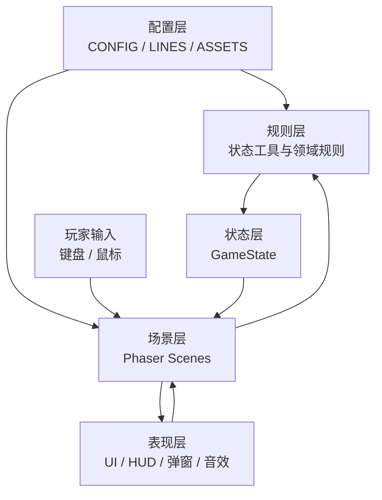
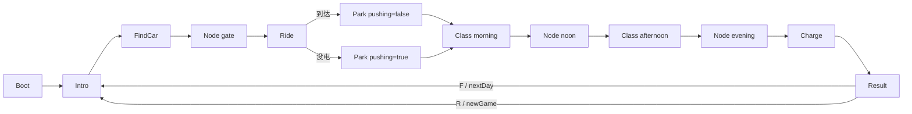

# 《小电驴的一天》实现架构设计

## 1. 文档定位

本文档定义项目的正式文件结构、模块职责、主要函数、状态字段归属、场景交接协议和扩展规则。

当前技术基线：Phaser 3.90.0、纯 JavaScript、普通 `<script>` 加载、无 npm、无打包工具。以 `doc/CLAUDE.md`、`src/` 代码和扩展版事件流程为准。

## 2. 总体架构



基本数据流：

```text
玩家输入 → 当前场景 → 规则计算 → GameState 更新 → UI 反馈 → 场景交接
```

场景只负责当前事件的画面、输入和局部对象；跨场景数据必须进入 `GameState`。

## 3. 正式目录结构

```text
FedExing/
├─ index.html                    页面入口与脚本加载顺序
├─ doc/                          项目文档目录
│  ├─ CLAUDE.md                 团队开发约束与设计基线
│  ├─ 项目说明.md                面向团队的项目说明
│  └─ 架构设计.md                本文档
├─ src/
│  ├─ config.js                  数值、时间、概率和玩法参数
│  ├─ lines.js                   所有面向玩家的中文文案
│  ├─ assets.js                  图片和音效清单
│  ├─ state.js                   全局状态、日循环、通用状态规则
│  ├─ ui.js                      输入、HUD、弹窗、气泡、时钟、音效
│  ├─ main.js                    Phaser 实例、调试入口、场景注册
│  ├─ scenes/
│  │  ├─ Boot.js                 资源加载和占位图生成
│  │  ├─ Intro.js                每天开场
│  │  ├─ FindCar.js              宿舍楼下找车
│  │  ├─ NodeScene.js            校门口、中午、傍晚菜单节点
│  │  ├─ Ride.js                 骑行、障碍、耗电、交警
│  │  ├─ Park.js                 教学楼停车
│  │  ├─ Class.js                上午课和下午课过场
│  │  ├─ Charge.js               夜间充电
│  │  └─ Result.js               当天结算和下一天入口
│  └─ systems/                   后续规则拆分目录，当前可不创建
│     ├─ TimeSystem.js
│     ├─ EconomySystem.js
│     ├─ TravelSystem.js
│     └─ EndingSystem.js
└─ assets/
   ├─ img/                       PNG 图片
   └─ sfx/                       MP3 音效
```

`systems/` 是后续扩展目录。只有规则被多个场景重复使用、或 `state.js` 变得过大时才拆出。

## 4. 入口和脚本依赖

### `index.html`

负责加载 Phaser 和项目脚本。顺序不能改变：

```text
Phaser → config.js → lines.js → assets.js → state.js → ui.js
→ scenes/*.js → main.js
```

项目使用全局对象，不使用 `import/export`，因此 `main.js` 必须最后加载。

### `src/main.js`

负责创建 `Phaser.Game`，配置 960×540 画布、Arcade 物理、无重力和场景列表。

主要字段：

```js
DEBUG_START  // 直接进入的场景名，正式演示为 null
DEBUG_DATA   // 传给场景的初始化参数
DEBUG_STATE  // 调试时覆盖 GameState
```

## 5. 配置层

### `src/config.js`

全局对象：`CONFIG`。只保存数字，不保存流程和长文案。

主要字段：

```js
CONFIG.timeScale
CONFIG.startClock / classStart / noonClock / eveningClock
CONFIG.nightClock / curfew
CONFIG.firstDayBattery / dayDrain / chargedThreshold
CONFIG.money / hunger / places / police / passenger
CONFIG.findCar / ride / ride.routes.inside / ride.routes.outside
CONFIG.park / charge
```

修改速度、概率、价格、耗电和时间，只改 `config.js`。

### `src/lines.js`

全局对象：`LINES`。主要分组：

```js
intro / findCar / backpack / gate / passenger / police
meals / ride / park / classScene / charge / endings / hungry
```

场景只读取 `LINES.xxx`，不在玩法代码中散落长句。

### `src/assets.js`

全局对象：`ASSETS`。图片条目包含：

```js
{ w, h, color, file, outline?, path?, crop? }
```

主要图片 key：`player`、`rider`、`pusher`、`bike`、`bike_other`、`rider_carry`、`npc_delivery`、`npc_wrong`、`npc_walker`、`npc_bus`、`npc_car`、`pile`、`slot`、`police`、`barrier`、`road`、`slope`、`grass`、`building`。

音效 key：`beep`、`hit`、`fall`、`park`、`plug`、`whistle`、`coin`。

图片默认路径为 `assets/img/<key>.png`，可用 `path` 指定子目录内的相对路径；音效放在 `assets/sfx/<key>.mp3`。`w/h` 是缺图时的占位尺寸；可选 `crop: { x, y, w, h }` 用于注册去除透明边缘的 `trimmed` 帧，原始文件不变。

宿舍找车素材：`dorm` → `background/dorm.png`；`dorm_bike` → `vehical/protagonist.png`；`dorm_bike_1`～`7` → `vehical/1.png`～`7.png`；`player_walk_left/right_1`～`3` → `character/player_walk_frames/`；`dorm_rider` → `character/riding/driving.png`。这些 key 仅用于 FindCar，避免改变 Ride / Park / Charge 的贴图尺寸和碰撞框。

## 6. 状态层：`src/state.js`

全局对象：`GameState`。

### 跨天保留字段

```js
battery       // 电量
money         // 钱，可为负
hunger        // 饱腹度
items         // { helmet, license }
helmetOn      // 是否戴头盔
```

### 每天重置字段

```js
clock / clockPaused
hp / late / hits / falls
findCarMinutes / arriveClock
chargeResult / chargeGain
route / passenger / policeToday
fines / earned / spent / meals
```

### 主要函数

```js
resetDay()                 // 重置当天状态
newGame()                  // 重置天数、资源、背包和当天状态
nextDay()                 // 进入下一天，扣过夜饥饿并发放生活费
isHungry()                // 判断是否饥饿
speedMul()                // 返回移动速度倍率
spend(amount)             // 扣钱并累计 spent
eat(food)                 // 增加饱腹度
policeCheck(carrying)     // 计算交警结果并修改状态
policeText(result)        // 生成交警提示文字
```

## 7. 公共表现层：`src/ui.js`

全局对象：`UI`。

### 初始化与输入

```js
UI.setup(scene)            // 注册按键、重置 UI、淡入
UI.blocked(scene)          // 判断弹窗或切场景阻塞
UI.dir(scene)              // 读取 WASD / 方向键
UI.pressedF(scene)         // 当前帧刚按下 F
UI.pressedE(scene)         // 当前帧刚按下 E
```

### 时间与 HUD

```js
UI.fmt(clock)
UI.createClock(scene)
UI.tickClock(scene, delta)
UI.createHud(scene, showHp)
UI.updateHud(scene)
```

### 反馈、弹窗和切场景

```js
UI.say(scene, text, target)
UI.hint(scene, text)
UI.choice(scene, question, options, onPick)
UI.alert(scene, text, onClose)
UI.backpack(scene, onClose)
UI.fadeTo(scene, key, data)
UI.sfx(scene, key)
UI.rand(value)
```

每个场景 `create()` 第一行调用 `UI.setup(this)`；每个需要 F 的场景在 `update()` 开头保存 `const f = UI.pressedF(this)`。

## 8. 场景层职责

所有场景都继承 `Phaser.Scene`。场景内部状态使用 `this.xxx`，跨场景状态使用 `GameState.xxx`。

### `Boot.js`

按 `path`（或默认路径）加载真实资源，为有效的 `crop` 注册 `trimmed` 帧，为缺失资源生成占位图，初始化后进入 `Intro` 或调试场景。

主要阶段：`preload()`、`create()`。

### `Intro.js`

显示天数、当前电量和开场文案，等待 F 或点击后进入：

```js
UI.fadeTo(this, 'FindCar')
```

### `FindCar.js`

职责：显示宿舍背景，在三排停车区生成车阵，播放步行动画、识别自己的车、挪开邻车、解锁并记录找车时间。`CONFIG.findCar` 集中配置地图、车阵位置、显示尺寸、碰撞框、交互距离与动画时长；`LINES.findCar` 保存操作提示。

主要字段：

```js
this.bikes / this.grid / this.myBike / this.neighbors
this.discovered / this.movedCount / this.player / this.done
this.walkFacing / this.rider / this.bikeMarker
```

主要函数：

```js
nearestBike(range)
createWalkAnimations()
updateWalkAnimation(direction)
interact(bike, mine, isNeighbor)
moveAway(bike)
unlock()
```

写入：`clock`、`findCarMinutes`。步行人物与停放车辆为独立对象；解锁时隐藏二者，显示骑车合成图，再进入 `Node gate`。左右各三帧循环，停下使用第 2 帧，上下移动沿用最近水平朝向。人物以脚底为原点，`UI.say()` 根据目标原点计算头顶位置。每日重新进入场景时重置局部状态，全局动画只注册一次。

试玩：Live Server 打开 `index.html`，开场按 F，WASD / 方向键移动，靠近车辆按 F 查看；确认主角车后，对左或右邻车按 F 挪开，再回主角车按 F 解锁。E 打开背包。可临时将 `DEBUG_START` 设为 `'FindCar'` 直接测试，演示前恢复 `null`。

### `NodeScene.js`

职责：实现纯菜单节点，通过 `data.kind` 复用：

```js
gate / noon / evening
```

主要函数：

```js
init(data)
gate()
pickRoute()
go(route, text)
meal()
houhu()
finish(text)
```

写入：`route`、`passenger`、`money`、`hunger`、`battery`、`items.license`、`meals`。

### `Ride.js`

职责：按路线骑行，处理速度、障碍、碰撞、血量、摔倒、耗电、乘客和交警。

主要字段：

```js
this.route / this.player / this.npcs
this.ROAD_L / this.ROAD_R / this.LANES
this.goalY / this.startY
this.slopeTopY / this.slopeBotY
this.policeY / this.policeDone
this.vy / this.invUntil / this.fallen / this.presses / this.ending
```

主要函数：

```js
spawn()
nearestLane(x)
cleanupNpcs()
onHit(obstacle)
police()
fall()
getUp()
batteryDead()
arrive()
```

写入：`clock`、`battery`、`hp`、`hits`、`falls`、`late`、`passenger`、`money`、`earned`、`fines`。

交接：

```js
UI.fadeTo(this, 'Park', { pushing: false })
UI.fadeTo(this, 'Park', { pushing: true })
```

### `Park.js`

职责：生成车棚、寻找空位、处理骑车 / 推车、记录停车时间和迟到状态。

主要字段：`this.pushing`、`this.speed`、`this.bikes`、`this.slots`、`this.player`、`this.done`。

主要函数：`init(data)`、`update(time, delta)`、`parkAt(slot)`。

写入：`arriveClock`、`late`。

当前实现停车时把 `player` 直接换成 `bike` 贴图。人车分离时应改成 `this.person` 和 `this.bike`，不要让 `this.player` 同时表示两种实体。

### `Class.js`

职责：实现上午课和下午课过场。

进入参数：

```js
{ part: 'morning' | 'afternoon' }
```

主要函数：`init(data)`、`create()`、`next()`。

上午：扣饥饿，时间到 `noonClock`，进入 `Node noon`。

下午：扣饥饿和 `dayDrain` 电量，时间到 `eveningClock`，进入 `Node evening`。

### `Charge.js`

职责：找桩、处理桩状态、收费、充电方式和门禁。

主要字段：`this.startBattery`、`this.piles`、`this.player`、`this.done`、`this.broke`。

主要函数：`tryPile(pile)`、`plugIn(pile)`、`curfew()`、`finish()`。

写入：`money`、`battery`、`clock`、`chargeResult`、`chargeGain`。

`chargeResult` 允许值：`none`、`noMoney`、`watch`、`full`、`unplugged`。

### `Result.js`

职责：读取当天状态、显示统计、计算四种结局、进入下一天或重新开始。

主要计算：

```js
charged = GameState.battery >= CONFIG.chargedThreshold
key = (GameState.late ? 'late' : 'ontime')
    + '_' + (charged ? 'charged' : 'empty')
```

结局 key：`ontime_charged`、`ontime_empty`、`late_charged`、`late_empty`。

主要函数：`create()`、`update()`。

## 9. 场景交接协议



短期场景参数示例：

```js
UI.fadeTo(this, 'Node', { kind: 'gate' })
UI.fadeTo(this, 'Park', { pushing: true })
UI.fadeTo(this, 'Class', { part: 'morning' })
```

短期参数只表达“如何进入场景”；电量、金钱、路线、迟到、罚款和充电结果必须写入 `GameState`。

## 10. 状态写入权责

| 字段 | 主要写入者 | 主要读取者 |
|---|---|---|
| `day` | `newGame()` / `nextDay()` | Intro、Result |
| `clock` | UI 时钟、各场景特殊事件 | 所有场景 |
| `battery` | Ride、Class、Node、Charge | HUD、Intro、Result |
| `hp` | Ride | Ride、HUD |
| `late` | Ride、Park | Class、Result |
| `hits` / `falls` | Ride | Result |
| `findCarMinutes` | FindCar | Result |
| `arriveClock` | Park | Class、Result |
| `chargeResult` / `chargeGain` | Charge | Result |
| `money` | state 工具、Node、Ride、Charge | HUD、Result |
| `hunger` | state 工具、Class、nextDay | HUD、Node、Result |
| `items` / `helmetOn` | newGame、UI 背包、Node | Ride、HUD、Result |
| `route` / `passenger` | Node、Ride | Ride、Result |
| `policeToday` / `fines` | state、警察规则 | Ride、Node、Result |
| `earned` / `spent` / `meals` | Ride、Node、state 工具 | Result |

新增字段必须先明确生命周期、写入者、读取者和重置时机。

## 11. 人车分离架构

长期目标：人物和电动车是两个独立实体：

```js
this.person
this.bike
```

职责：

```text
person：玩家输入、站立、摔倒、背包、离开
bike：骑行、碰撞、停车、充电、电量归属
```

过渡期可以保留 `this.player = this.person`，但不应继续让 `this.player` 在不同场景中有时表示人、有时表示车。

改造顺序：先改 `Ride`，再改 `Park`，最后改 `Charge`。

## 12. 后续规则模块

当前规则可以继续放在 `state.js`。出现以下情况时再创建 `src/systems/`：

- 同一规则被三个以上场景调用。
- `state.js` 难以维护。
- 规则需要独立测试。
- 一个规则同时修改多个状态字段。

推荐函数：

```js
TimeSystem: advanceClock(), setClock(), isBefore()
EconomySystem: spend(), earn(), canAfford()
TravelSystem: resolvePoliceCheck(), completePassengerRide()
EndingSystem: isCharged(), getEndingKey()
```

拆分后，`state.js` 仍只负责状态和生命周期，不变成新的场景控制器。

## 13. 实现规范

1. 每个场景 `create()` 第一行调用 `UI.setup(this)`。
2. 每个需要 F 的场景在 `update()` 开头调用 `const f = UI.pressedF(this)`。
3. 数字进入 `CONFIG`，文字进入 `LINES`。
4. 场景之间只通过 `GameState` 和 `UI.fadeTo()` 交接。
5. 弹窗、HUD、气泡、音效和时钟只由 `UI` 提供。
6. 场景内部状态使用 `this.xxx`，跨场景状态使用 `GameState.xxx`。
7. 新增状态字段要同步更新 `doc/CLAUDE.md`、`doc/项目说明.md` 和本文档。
8. 不让 `this.player` 同时承担人物和车辆两个长期语义。
9. 改完后测试完整流程和对应的 `DEBUG_START` 入口。
10. 正式演示前确认 `DEBUG_START = null`。

## 14. 测试入口

| 入口 | 验证内容 |
|---|---|
| `DEBUG_START = 'FindCar'` | 找车、挪车、找车时间 |
| `DEBUG_START = 'Node'` + `{ kind: 'gate' }` | 载人、路线、背包 |
| `DEBUG_START = 'Ride'` | 路线、耗电、障碍、摔倒、交警 |
| `DEBUG_START = 'Park'` + `{ pushing: true }` | 推车、迟到、停车 |
| `DEBUG_START = 'Class'` + `{ part: 'morning' }` | 上午课、饥饿、时间 |
| `DEBUG_START = 'Node'` + `{ kind: 'noon' }` | 吃饭、后湖、办牌照 |
| `DEBUG_START = 'Charge'` | 找桩、付费、充电、门禁 |
| `DEBUG_START = 'Result'` | 四种结局、下一天、重开 |

完整流程：

```text
Boot → Intro → FindCar → Node gate → Ride → Park
→ Class morning → Node noon → Class afternoon
→ Node evening → Charge → Result → Intro
```

## 15. 架构目标

```text
改数值，不动场景代码
改文案，不动规则代码
改 UI，不动事件规则
新增事件，只新增场景或规则模块
人物和车辆可以独立表现
跨天状态可追踪、可重置、可测试
```
