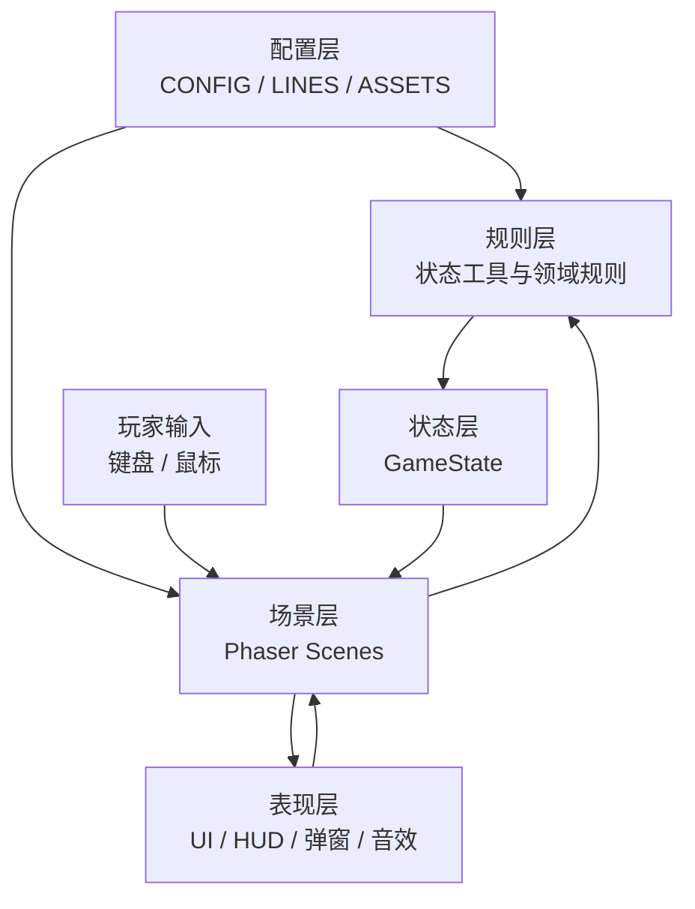
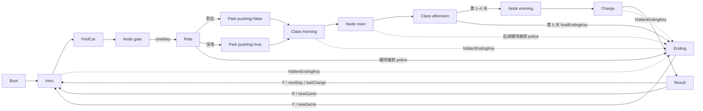

# 《小电驴的一天》实现架构设计

## 1. 文档定位

本文档定义项目的正式文件结构、模块职责、主要函数、状态字段归属、场景交接协议和扩展规则。

当前技术基线：Phaser 3.90.0、纯 JavaScript、普通 `<script>` 加载、无 npm、无打包工具。以 `doc/CLAUDE.md`、`src/` 代码和扩展版事件流程为准。

## 2. 总体架构



基本数据流：

```text
玩家输入 → 当前场景 → 规则计算 → GameState 更新 → UI 反馈 → 场景交接
```

场景只负责当前事件的画面、输入和局部对象；跨场景数据必须进入 `GameState`。

## 3. 正式目录结构

```text
FedExing/
├─ index.html                    页面入口与脚本加载顺序
├─ doc/                          项目文档目录
│  ├─ CLAUDE.md                 团队开发约束与设计基线
│  ├─ 项目说明.md                面向团队的项目说明
│  └─ 架构设计.md                本文档
├─ src/
│  ├─ config.js                  数值、时间、概率和玩法参数
│  ├─ lines.js                   所有面向玩家的中文文案
│  ├─ assets.js                  图片和音效清单
│  ├─ state.js                   全局状态、日循环、通用状态规则
│  ├─ ui.js                      输入、HUD、弹窗、气泡、时钟、音效
│  ├─ main.js                    Phaser 实例、调试入口、场景注册
│  ├─ scenes/
│  │  ├─ Boot.js                 资源加载和占位图生成
│  │  ├─ Intro.js                每天开场
│  │  ├─ FindCar.js              宿舍楼下找车
│  │  ├─ NodeScene.js            校门口、中午、傍晚菜单节点
│  │  ├─ Ride.js                 骑行、障碍、耗电、交警
│  │  ├─ Park.js                 教学楼停车
│  │  ├─ Class.js                上午课和下午课过场
│  │  ├─ Charge.js               夜间充电
│  │  ├─ Result.js               当天结算（今日评价）和下一天入口
│  │  └─ Ending.js               最终结局 / 隐藏结局，重新开始入口
│  └─ systems/                   后续规则拆分目录，当前可不创建
│     ├─ TimeSystem.js
│     ├─ EconomySystem.js
│     ├─ TravelSystem.js
│     └─ EndingSystem.js
└─ assets/
   ├─ img/                       PNG 图片
   └─ sfx/                       MP3 音效
```

`systems/` 是后续扩展目录。只有规则被多个场景重复使用、或 `state.js` 变得过大时才拆出。

## 4. 入口和脚本依赖

### `index.html`

负责加载 Phaser 和项目脚本。顺序不能改变：

```text
Phaser → config.js → lines.js → assets.js → state.js → ui.js
→ scenes/*.js（Result.js 之后是 Ending.js） → main.js
```

项目使用全局对象，不使用 `import/export`，因此 `main.js` 必须最后加载。

### `src/main.js`

负责创建 `Phaser.Game`，配置 960×540 画布、Arcade 物理、无重力和场景列表 `GAME_SCENES`（`Boot, Intro, FindCar, NodeScene, Ride, Park, Class, Charge, Result, Ending`）。

主要字段：

```js
DEBUG_START  // 直接进入的场景名，正式演示为 null
DEBUG_DATA   // 传给场景的初始化参数，例如 Ending 的 { key: 'broke' }
DEBUG_STATE  // 调试时覆盖 GameState，例如 { day: 5, lateCount: 3 } 直接测最终结局
```

## 5. 配置层

### `src/config.js`

全局对象：`CONFIG`。只保存数字，不保存流程和长文案。

主要字段：

```js
CONFIG.timeScale
CONFIG.startClock / classStart / noonClock / afternoonClass / eveningClock
CONFIG.nightClock / curfew
CONFIG.firstDayBattery / dayDrain / chargedThreshold
CONFIG.ending            // totalDays 几天判最终结局、passMaxLate 合格的迟到上限
CONFIG.money / hunger / places / police / passenger
CONFIG.findCar / ride / ride.oneWay / ride.routes.inside / ride.routes.outside
CONFIG.park / charge
```

修改速度、概率、价格、耗电和时间，只改 `config.js`。

### `src/lines.js`

全局对象：`LINES`。主要分组：

```js
intro / findCar / backpack / gate / passenger / police
meals / ride / park / classScene / charge / hungry / faintWarn
endings       // 每日评价（Result）
finalEnding   // 6 个结局的 { title, text }（Ending）
endingUi      // Ending 的统计行和重开提示
```

场景只读取 `LINES.xxx`，不在玩法代码中散落长句。

### `src/assets.js`

全局对象：`ASSETS`。图片条目包含：

```js
{ w, h, color, file, outline? }
```

主要图片 key：`player`、`rider`、`pusher`、`bike`、`bike_other`、`rider_carry`、`npc_delivery`、`npc_wrong`、`npc_walker`、`npc_bus`、`npc_car`、`pile`、`slot`、`police`、`barrier`、`road`、`slope`、`grass`、`building`。

结局图 key（Ending 用，320×240）：`end_perfect`、`end_pass`、`end_fail`、`end_police`、`end_faint`、`end_broke`。

音效 key：`beep`、`hit`、`fall`、`park`、`plug`、`whistle`、`coin`。

真实资源放在 `assets/img/` 和 `assets/sfx/`，文件名必须与 key 一致。

## 6. 状态层：`src/state.js`

全局对象：`GameState`。

### 跨天保留字段

```js
battery       // 电量
money         // 钱，可为负；≤ 0 进"身无分文"结局
hunger        // 饱腹度；≤ 0 进"昏倒"结局
items         // { helmet, license }
helmetOn      // 是否戴头盔
lateCount     // 本局累计迟到次数（上午、下午各算一次），newGame() 清 0
runs          // 硬闯交警成功次数，newGame() 清 0
```

### 每天重置字段

```js
clock / clockPaused
hp / late / latePM / hits / falls
findCarMinutes / arriveClock
chargeResult / chargeGain
route / passenger / policeToday
fines / earned / spent / meals
```

- `late` 只表示**上午**迟到；`latePM` 表示下午迟到。
- `chargeResult`：`'none'` | `'noMoney'` | `'full'` | `'unplugged'`（v2 去掉了 `'watch'`）。
- 结局 key、今天是否单行道**不**进 GameState，走 `UI.fadeTo` 的 data（见第 9 节）。

### 主要函数

```js
resetDay()                 // 重置当天状态
newGame()                  // 重置天数、资源、背包、lateCount、runs 和当天状态
nextDay()                 // 进入下一天，扣过夜饥饿并发放生活费
isHungry()                // 判断是否饥饿
speedMul()                // 返回移动速度倍率
spend(amount)             // 扣钱并累计 spent
eat(food)                 // 增加饱腹度
earn(amount)              // 加钱并累计 earned
addFine(reason, amount)   // 记一笔罚款（不算 spent，可扣成负数）
isCharged()               // 电量 ≥ chargedThreshold
getEndingKey()            // 今日评价 key（Result 用）
policeCheck(carrying)     // 计算交警结果并修改状态
policeText(result)        // 生成交警提示文字

// v2 结局：只计算，不跳场景；跳转由场景 UI.fadeTo(this, 'Ending', { key }) 做
isBroke()                 // money <= 0
isFainted()               // hunger <= 0
hiddenEndingKey()         // 'faint' | 'broke' | null，昏倒优先；派出所不在这里判
finalEndingKey()          // lateCount 0 → 'perfect'；≤ passMaxLate → 'pass'；否则 'fail'
isLastDay()               // day >= CONFIG.ending.totalDays
runCatchChance()          // 这次硬闯被抓的概率：min(runCatchMax, runCatchBase + runs × runCatchStep)
tryRun()                  // 掷一次硬闯：true = 闯过去（runs + 1），false = 被抓（调用方跳 Ending{police}）
```

## 7. 公共表现层：`src/ui.js`

全局对象：`UI`。

### 初始化与输入

```js
UI.setup(scene)            // 注册按键、重置 UI、淡入
UI.blocked(scene)          // 判断弹窗或切场景阻塞
UI.dir(scene)              // 读取 WASD / 方向键
UI.pressedF(scene)         // 当前帧刚按下 F
UI.pressedE(scene)         // 当前帧刚按下 E
```

### 时间与 HUD

```js
UI.fmt(clock)
UI.createClock(scene)
UI.tickClock(scene, delta)
UI.createHud(scene, showHp)
UI.updateHud(scene)
```

### 反馈、弹窗和切场景

```js
UI.say(scene, text, target)
UI.hint(scene, text)
UI.choice(scene, question, options, onPick)
UI.alert(scene, text, onClose)
UI.backpack(scene, onClose)
UI.fadeTo(scene, key, data)
UI.sfx(scene, key)
UI.rand(value)
```

每个场景 `create()` 第一行调用 `UI.setup(this)`；每个需要 F 的场景在 `update()` 开头保存 `const f = UI.pressedF(this)`。

## 8. 场景层职责

所有场景都继承 `Phaser.Scene`。场景内部状态使用 `this.xxx`，跨场景状态使用 `GameState.xxx`。

### `Boot.js`

加载真实资源，为缺失资源生成占位图，初始化后进入 `Intro` 或调试场景。

主要阶段：`preload()`、`create()`。

### `Intro.js`

进入参数：

```js
{ lastCharge: 'none' | 'noMoney' | 'full' | 'unplugged' }   // Result 按 F 时传入，nextDay() 已重置 chargeResult
```

第 2 天起先查 `hiddenEndingKey()`（过夜扣完饥饿可能饿晕），有就进 `Ending`。否则显示天数、当前电量、钱 / 饥饿、「本周已迟到 N 次」（最后一天加提醒）和开场文案；`lastCharge` 为 `full` / `unplugged` 时在文案前揭晓昨晚充电结果。等待 F 或点击后进入：

```js
UI.fadeTo(this, 'FindCar')
```

### `FindCar.js`

职责：生成车阵、识别自己的车、挪开邻车、挪车带倒一排（多米诺）和扶车、解锁并记录找车时间。

主要字段：

```js
this.bikes / this.grid / this.myBike / this.neighbors
this.discovered / this.movedCount / this.player / this.done
```

主要函数：

```js
nearestBike(range)
interact(bike, mine, isNeighbor)
moveAway(bike)
domino(bike)          // 挪车时按 findCar.dominoChance 带倒同一排
hasFallen() / nearestFallen(r) / liftBike(b)
unlock()              // 倒着的车全扶起来才能解锁
```

写入：`clock`、`findCarMinutes`。完成后进入 `Node gate`。

### `NodeScene.js`

职责：实现纯菜单节点，通过 `data.kind` 复用：

```js
gate / noon / evening
```

主要函数：

```js
init(data)
gate()          // 两条路线各掷一次单行道，存 this.oneWay，透露给玩家
pickRoute()
go(route, text) // UI.fadeTo(this, 'Ride', { oneWay: this.oneWay[route] })
meal()          // 每个选项加 places.*.minutes；花完钱 ≤ 0 的选项标"买完就身无分文了"
houhu()         // 碰到交警：停车受检 policeCheck / 硬闯 tryRun
finish(text)    // 先查 hiddenEndingKey()，再进下一场景
```

写入：`clock`、`route`、`passenger`、`money`、`spent`、`hunger`、`battery`、`items.license`、`meals`、`fines`、`runs`。

### `Ride.js`

职责：按路线骑行，处理速度、障碍、车道让行、单行道路段、碰撞、血量、摔倒、耗电、乘客和交警（停车受检 / 硬闯）。

进入参数：

```js
{ oneWay: boolean }   // Node gate 掷好的"今天这条路是否挤成单行道"；DEBUG 直接进时可能是 {}
```

主要字段：

```js
this.route / this.player / this.npcs / this.oneWay
this.ROAD_L / this.ROAD_R / this.LANES
this.goalY / this.startY
this.slopeTopY / this.slopeBotY
this.oneWayTopY / this.oneWayBotY
this.policeY / this.policeDone / this.barrier
this.vy / this.invUntil / this.fallen / this.presses / this.ending
```

主要函数：

```js
spawn()
addCar(type, key, want, y, vy)   // 出生点 followGap 内同道有车就换道，都有就不生成
pickType()                       // 单行道路段逆行权重 × wrongMul
nearestLane(x) / inOneWay(y)
trafficStep(delta)               // 每帧车道让行：排队 / 变道超车 / 逆行躲让
walkerStep(o, speed)             // 行人等车
laneFree() / carAhead() / changeLane()
cleanupNpcs()
onHit(obstacle)
police()                         // 弹二选一
policeStop()                     // policeCheck，弹窗关掉后查 hiddenEndingKey()
policeRun()                      // tryRun()：被抓 → Ending{police}；成功 → 保护时间 + 预兆
fall()
getUp()
batteryDead()
arrive()
```

写入：`clock`、`battery`、`hp`、`hits`、`falls`、`late`、`passenger`、`money`、`earned`、`fines`、`runs`。

交接：

```js
UI.fadeTo(this, 'Park', { pushing: false })
UI.fadeTo(this, 'Park', { pushing: true })
UI.fadeTo(this, 'Ending', { key: 'police' })   // 硬闯被抓
UI.fadeTo(this, 'Ending', { key })             // 罚到钱 ≤ 0
```

### `Park.js`

职责：生成车棚、寻找空位、处理骑车 / 推车、记录停车时间和迟到状态。

主要字段：`this.pushing`、`this.speed`、`this.bikes`、`this.slots`、`this.player`、`this.done`。

主要函数：`init(data)`、`update(time, delta)`、`parkAt(slot)`、`askIllegal()`。

写入：`arriveClock`、`late`；违停被贴条写 `fines`、`money`，弹窗关掉后查 `hiddenEndingKey()`。

当前实现停车时把 `player` 直接换成 `bike` 贴图。人车分离时应改成 `this.person` 和 `this.bike`，不要让 `this.player` 同时表示两种实体。

### `Class.js`

职责：实现上午课和下午课过场，判迟到、扣饥饿，决定是否进结局。

进入参数：

```js
{ part: 'morning' | 'afternoon' }
```

主要函数：`init(data)`、`create()`、`next()`。

上午：`late` 为 true → `lateCount + 1`；扣饥饿，时间到 `noonClock`，进入 `Node noon`。

下午：进场时 `clock > afternoonClass` → `latePM = true`、`lateCount + 1`；扣饥饿和 `dayDrain` 电量，时间到 `eveningClock`，进入 `Node evening`。

`next()` 优先级：`hiddenEndingKey()` → `Ending{faint / broke}`；下午且 `isLastDay()` → `Ending{finalEndingKey()}`；否则照常进 Node。

### `Charge.js`

职责：找桩、处理桩状态、收费、定充电结果和门禁。v2 去掉了"守着充"：插上就回宿舍，按 `gambleWinRate` 充满或被拔线，结果不当场揭晓（插上后 HUD 冻住），第二天 Intro 再说。

主要字段：`this.startBattery`、`this.piles`、`this.player`、`this.done`、`this.broke`。

主要函数：`tryPile(pile)`、`plugIn(pile)`、`curfew()`、`finish()`。

写入：`money`、`battery`、`clock`、`chargeResult`、`chargeGain`。

`chargeResult` 允许值：`none`、`noMoney`、`full`、`unplugged`。

`finish()` 查 `hiddenEndingKey()`：扫码 ¥2 扣到钱 ≤ 0 → `Ending{broke}`，否则进 `Result`。

### `Result.js`

职责：读取当天状态、显示统计、计算四种**今日评价**、进入下一天或重新开始。今日评价不影响最终结局；最后一天下午课结束直接进 `Ending`，不会走到这里。

主要计算（规则在 state.js）：

```js
charged = isCharged()
key = getEndingKey()   // (late ? 'late' : 'ontime') + '_' + (charged ? 'charged' : 'empty')
```

今日评价 key：`ontime_charged`、`ontime_empty`、`late_charged`、`late_empty`。

统计行比 v1 多「下午：准时 / 迟到」和「累计迟到 N 次」。

主要函数：`create()`、`update()`。按 F：先记下 `chargeResult`，`nextDay()`，再 `UI.fadeTo(this, 'Intro', { lastCharge })`；按 R：`newGame()`。

### `Ending.js`

职责：显示最终结局 / 隐藏结局，重新开始。

进入参数：

```js
{ key: 'perfect' | 'pass' | 'fail' | 'police' | 'faint' | 'broke' }
```

| key | 谁跳进来 |
|---|---|
| `perfect` / `pass` / `fail` | Class 下午课、`isLastDay()`，用 `finalEndingKey()` |
| `police` | Ride `policeRun()` / Node `houhu()` 里 `tryRun()` 返回 false |
| `faint` / `broke` | Intro、Class、Ride、Park、Node、Charge 里 `hiddenEndingKey()` 非空 |

画面：结局图 `end_<key>`（没图用色块）从小弹到正常大小，`LINES.finalEnding[key]` 的标题、描述依次淡入，底部统计（第几天、累计迟到、硬闯成功次数、余额）。隐藏结局深红底，正常结局深蓝底。

主要函数：`init(data)`、`create()`、`update()`、`restart()`。1.2 秒后按 F / 点击 → `newGame()` 回 `Intro`。不写 GameState。

## 9. 场景交接协议



虚线只画了一部分：`hiddenEndingKey()` 在 Intro、Class、Ride 交警罚款后、Park 贴条后、Node 每个选项后、Charge 结束时都会查。

短期场景参数示例：

```js
UI.fadeTo(this, 'Node', { kind: 'gate' })
UI.fadeTo(this, 'Ride', { oneWay: true })            // 今天这条路是否挤成单行道
UI.fadeTo(this, 'Park', { pushing: true })
UI.fadeTo(this, 'Class', { part: 'morning' })
UI.fadeTo(this, 'Intro', { lastCharge: 'full' })     // 昨晚充电结果，第二天早上揭晓
UI.fadeTo(this, 'Ending', { key: 'broke' })          // 结局 key
```

短期参数只表达“如何进入场景”；电量、金钱、路线、迟到、罚款和充电结果必须写入 `GameState`。`oneWay`、`lastCharge`、结局 `key` 都是一次性的展示信息，不新增 GameState 字段。

## 10. 状态写入权责

| 字段 | 主要写入者 | 主要读取者 |
|---|---|---|
| `day` | `newGame()` / `nextDay()` | Intro、Result、Ending、`isLastDay()` |
| `clock` | UI 时钟、各场景特殊事件、Node 选项花的时间 | 所有场景 |
| `battery` | Ride、Class、Node、Charge | HUD、Intro、Result |
| `hp` | Ride | Ride、HUD |
| `late` | Ride、Park | Class、Result |
| `latePM` | Class 下午 | Result |
| `lateCount` | Class（上午、下午各判一次）；`newGame()` 清 0 | Intro、Class、Result、Ending、`finalEndingKey()` |
| `runs` | `tryRun()`（Ride、Node 调用）；`newGame()` 清 0 | Ending、`runCatchChance()` |
| `hits` / `falls` | Ride | Result |
| `findCarMinutes` | FindCar | Result |
| `arriveClock` | Park | Class、Result |
| `chargeResult` / `chargeGain` | Charge | Result（按 F 时作为 `lastCharge` 传给 Intro） |
| `money` | state 工具、Node、Ride、Park、Charge | HUD、Result、Ending、`isBroke()` |
| `hunger` | state 工具、Class、nextDay | HUD、Node、Intro、Class、`isFainted()` |
| `items` / `helmetOn` | newGame、UI 背包、Node | Ride、HUD、Result |
| `route` / `passenger` | Node、Ride | Ride、Result |
| `policeToday` / `fines` | state、警察规则 | Ride、Node、Result |
| `earned` / `spent` / `meals` | Ride、Node、state 工具 | Result |

新增字段必须先明确生命周期、写入者、读取者和重置时机。

## 11. 人车分离架构

长期目标：人物和电动车是两个独立实体：

```js
this.person
this.bike
```

职责：

```text
person：玩家输入、站立、摔倒、背包、离开
bike：骑行、碰撞、停车、充电、电量归属
```

过渡期可以保留 `this.player = this.person`，但不应继续让 `this.player` 在不同场景中有时表示人、有时表示车。

改造顺序：先改 `Ride`，再改 `Park`，最后改 `Charge`。

## 12. 后续规则模块

当前规则可以继续放在 `state.js`。出现以下情况时再创建 `src/systems/`：

- 同一规则被三个以上场景调用。
- `state.js` 难以维护。
- 规则需要独立测试。
- 一个规则同时修改多个状态字段。

推荐函数：

```js
TimeSystem: advanceClock(), setClock(), isBefore()
EconomySystem: spend(), earn(), canAfford()
TravelSystem: resolvePoliceCheck(), completePassengerRide()
EndingSystem: isCharged(), getEndingKey(), hiddenEndingKey(), finalEndingKey()
```

拆分后，`state.js` 仍只负责状态和生命周期，不变成新的场景控制器。

## 13. 实现规范

1. 每个场景 `create()` 第一行调用 `UI.setup(this)`。
2. 每个需要 F 的场景在 `update()` 开头调用 `const f = UI.pressedF(this)`。
3. 数字进入 `CONFIG`，文字进入 `LINES`。
4. 场景之间只通过 `GameState` 和 `UI.fadeTo()` 交接。
5. 弹窗、HUD、气泡、音效和时钟只由 `UI` 提供。
6. 场景内部状态使用 `this.xxx`，跨场景状态使用 `GameState.xxx`。
7. 新增状态字段要同步更新 `doc/CLAUDE.md`、`doc/项目说明.md` 和本文档。
8. 不让 `this.player` 同时承担人物和车辆两个长期语义。
9. 改完后测试完整流程和对应的 `DEBUG_START` 入口。
10. 正式演示前确认 `DEBUG_START = null`。

## 14. 测试入口

| 入口 | 验证内容 |
|---|---|
| `DEBUG_START = 'FindCar'` | 找车、挪车、多米诺扶车、找车时间 |
| `DEBUG_START = 'Node'` + `{ kind: 'gate' }` | 载人、路线、单行道传闻、背包 |
| `DEBUG_START = 'Ride'` | 路线、耗电、障碍、车道让行、单行道、摔倒、交警停 / 闯 |
| `DEBUG_START = 'Park'` + `{ pushing: true }` | 推车、迟到、停车 |
| `DEBUG_START = 'Class'` + `{ part: 'morning' }` | 上午课、饥饿、时间、迟到计数 |
| `DEBUG_START = 'Node'` + `{ kind: 'noon' }` | 吃饭、后湖、办牌照、选项耗时、下午迟到 |
| `DEBUG_START = 'Charge'` | 找桩、付费、插上直接结束、门禁 |
| `DEBUG_START = 'Result'` | 四种今日评价、下一天、重开 |
| `DEBUG_START = 'Ending'` + `{ key: 'broke' }` | 6 个结局画面、重开 |
| `DEBUG_START = 'Class'` + `{ part: 'afternoon' }` + `DEBUG_STATE = { day: 5, lateCount: 3 }` | 最后一天下午课后进最终结局（lateCount 改 0 → 完美，改 6 → 不合格） |
| `DEBUG_START = 'Class'` + `DEBUG_STATE = { hunger: 10 }` | 扣完饥饿进昏倒结局 |

完整流程：

```text
Boot → Intro → FindCar → Node gate → Ride → Park
→ Class morning → Node noon → Class afternoon
→ Node evening → Charge → Result → Intro（重复 5 天）
第 5 天：… → Class afternoon → Ending → Intro
```

## 15. 架构目标

```text
改数值，不动场景代码
改文案，不动规则代码
改 UI，不动事件规则
新增事件，只新增场景或规则模块
人物和车辆可以独立表现
跨天状态可追踪、可重置、可测试
```
